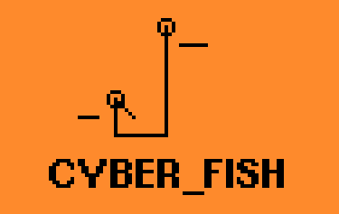
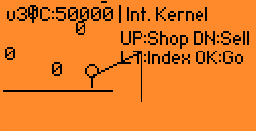
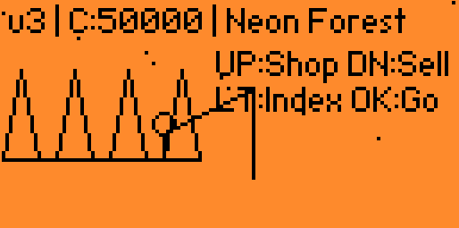

# 🎣 CYBER_FISHING v1.0

A cyberpunk-themed fishing RPG developed specifically for the **Flipper Zero**. 

In the year 2026, data is the only currency that matters. Cast your line into the digital stream, reel in rare packets, and upgrade your hardware to breach the Internal Kernel.

## ✨ Features
* **5 Unique Sectors:** Travel from the Cyber Docks to the Void Sector.
* **Buzzer & Haptics:** Full audio/visual feedback for bites and catches.
* **Prestige System:** Reformat your System Core to gain 25% sell bonuses.
* **Hardware Upgrades:** Improve your Buffer, Antenna, and Lure.

## 🛠️ How to Build
Ensure you have `ufbt` installed.
1. Clone the repo: `git clone https://github.com/YOUR_USERNAME/cyber_fishing.git`
2. Connect your Flipper.
3. Run: `ufbt launch`

OR

1. Download repo
2. Transfer files to Flipper via qFlipper or Flipper mobile app.

## 🎮 Controls
* **OK:** Cast line / Reel in / Confirm
* **UP:** Hardware Shop
* **DOWN:** Market (Sell Packets)
* **LEFT:** Net Index (Collection)
* **BACK:** Return to menu / Exit

